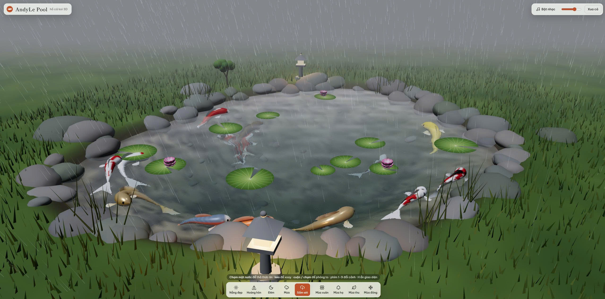

# Hồ cá koi 3D, nghe nhạc thư giãn !!!!

AndyLe Pool là một hồ cá Koi 3D tương tác chạy trực tiếp trên trình duyệt.
Ứng dụng mô phỏng mặt nước, cá Koi, thời tiết, mùa trong năm, ánh sáng và nhạc nền theo từng khung cảnh.

✨ Tính năng chính

Hồ cá Koi 3D tương tác bằng Three.js / WebGL.

Chạm hoặc click mặt nước để thả thức ăn cho cá.

Kéo chuột để xoay góc nhìn.

Cuộn chuột hoặc chụm hai ngón để phóng to / thu nhỏ.

Nút Xua cá tạo phản ứng cho đàn cá.

Hiệu ứng mặt nước, gợn sóng, phản xạ và khúc xạ.

Hiệu ứng ánh sáng thay đổi theo từng cảnh.

Hỗ trợ nhiều trạng thái thời tiết và mùa.

Nhạc nền riêng cho từng cảnh.

Hiệu ứng sấm được tạo trực tiếp bằng Web Audio API.

Giao diện responsive, dùng được trên máy tính và thiết bị di động.

Không cần framework hoặc bước build riêng.

🌤 Các khung cảnh

Phím

Cảnh

1

☀️ Nắng đẹp

2

🌅 Hoàng hôn

3

🌙 Đêm

4

🌧 Mưa

5

⛈ Sấm sét

6

🌸 Mùa xuân

7

🌿 Mùa hạ

8

🍂 Mùa thu

9

❄️ Mùa đông

🎮 Điều khiển

Thao tác

Chức năng

Click / chạm mặt nước

Thả thức ăn

Kéo chuột / kéo ngón tay

Xoay camera

Cuộn chuột / pinch

Zoom

Space

Xua cá

M

Bật / tắt nhạc

H

Ẩn / hiện giao diện

1 → 9

Chuyển nhanh giữa các cảnh

🎵 Thêm nhạc nền

Tạo thư mục:

music/

đặt cạnh file index.html.

Cấu trúc đề xuất:

AndyLe-Pool/
├── index.html
├── README.md
├── LICENSE
├── screenshot.jpg
└── music/
    ├── sunny.mp3
    ├── sunset.mp3
    ├── night.mp3
    ├── rain.mp3
    ├── storm.mp3
    ├── spring.mp3
    ├── summer.mp3
    ├── autumn.mp3
    ├── winter.mp3
    └── default.mp3

Các định dạng âm thanh được hỗ trợ:

.mp3
.m4a
.ogg
.wav

Nếu một cảnh không có file nhạc riêng, ứng dụng sẽ thử dùng:

music/default.*

Riêng cảnh mùa đông có thể dùng:

winter.*

hoặc:

snow.*

Lưu ý về bản quyền âm thanh: Apache License 2.0 chỉ áp dụng cho mã nguồn của dự án nếu bạn khai báo như vậy. Các file nhạc, hình ảnh hoặc tài nguyên bên thứ ba không tự động trở thành Apache 2.0. Chỉ đưa lên repository những tài nguyên bạn sở hữu hoặc có quyền phân phối.

🚀 Chạy ứng dụng

AndyLe Pool là ứng dụng web tĩnh, không cần npm install.

Cách 1 — GitHub Pages

Upload toàn bộ project lên GitHub.

Vào Settings của repository.

Chọn Pages.

Trong Build and deployment, chọn:

Source: Deploy from a branch

Branch: main

Folder: / (root)

Bấm Save.

Chờ GitHub hoàn tất deploy.

Sau đó GitHub sẽ cung cấp URL để chạy app trực tuyến.

Cách 2 — Chạy local bằng Python

Mở Terminal / CMD tại thư mục project:

python -m http.server 8000

Sau đó mở trình duyệt:

http://localhost:8000

Khuyến nghị chạy qua HTTP thay vì mở trực tiếp index.html bằng file://.

🧩 Công nghệ sử dụng

HTML5

CSS3

JavaScript ES Modules

WebGL

Three.js 0.170.0

Three.js OrbitControls

Three.js BufferGeometryUtils

Web Audio API

Google Fonts

Three.js và Google Fonts hiện được tải từ CDN, vì vậy khi chạy phiên bản hiện tại cần có kết nối Internet để tải các dependency này.

📁 Cấu trúc repository

.
├── index.html          # Toàn bộ ứng dụng AndyLe Pool
├── screenshot.jpg      # Hình preview dùng trong README
├── README.md           # Tài liệu hướng dẫn
├── LICENSE             # Apache License 2.0
└── music/              # Nhạc nền theo từng cảnh

📜 License

Mã nguồn của AndyLe Pool được phát hành theo Apache License 2.0.

Apache License 2.0 cho phép người khác:

sử dụng mã nguồn;

chỉnh sửa;

phân phối lại;

sử dụng cho mục đích thương mại;

tạo sản phẩm phát triển từ mã nguồn;

với điều kiện họ phải tuân thủ các yêu cầu của Apache License 2.0, bao gồm việc giữ lại thông tin bản quyền và giấy phép liên quan, đồng thời ghi chú các file đã được thay đổi khi phân phối phiên bản sửa đổi.

Xem toàn bộ điều khoản trong file:

LICENSE

Quan trọng: Nếu bạn không muốn người khác sử dụng code cho mục đích thương mại hoặc không muốn họ tạo sản phẩm dựa trên code của bạn, Apache License 2.0 không phù hợp, vì đây là giấy phép mã nguồn mở có tính permissive.

Cách thêm Apache License 2.0 trên GitHub

Trong repository GitHub:

Chọn Add file.

Chọn Create new file.

Đặt tên file:

LICENSE

Chọn Choose a license template.

Chọn Apache License 2.0.

Điền năm và chủ sở hữu bản quyền, ví dụ:

2026 AndyLeAI

Bấm Review and submit / Commit changes.

GitHub sau đó sẽ tự nhận diện repository là:

Apache-2.0

© Copyright

Copyright 2026 AndyLeAI

Licensed under the Apache License, Version 2.0.

👤 Author

AndyLeAI

Nếu bạn phát triển thêm tính năng, hãy tạo branch riêng và gửi Pull Request để dễ quản lý thay đổi.
